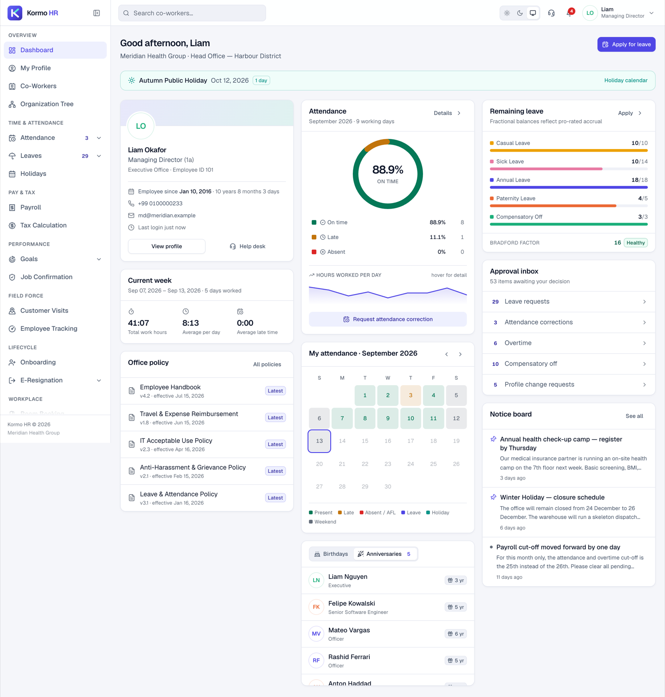
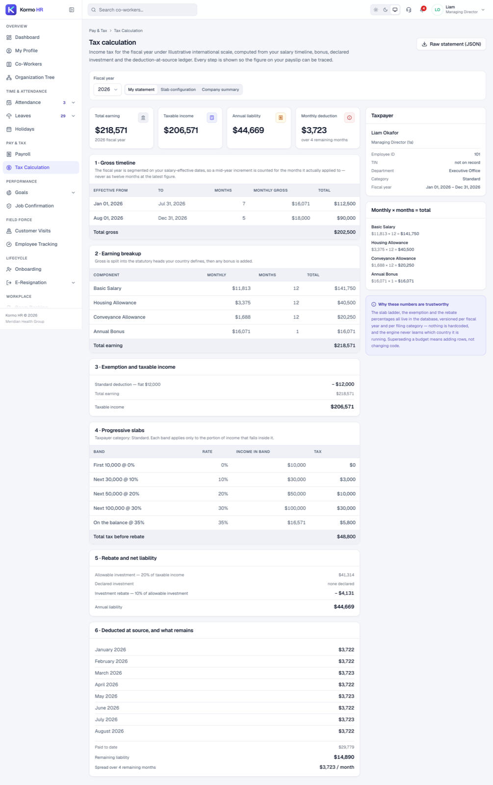
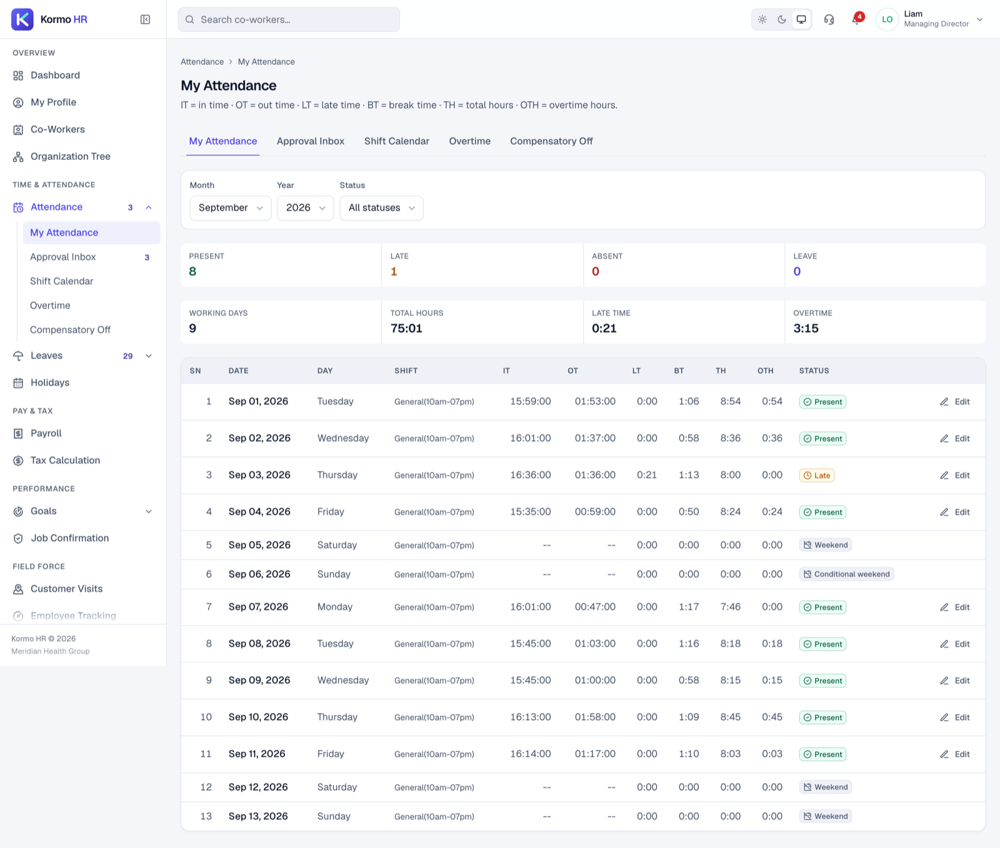
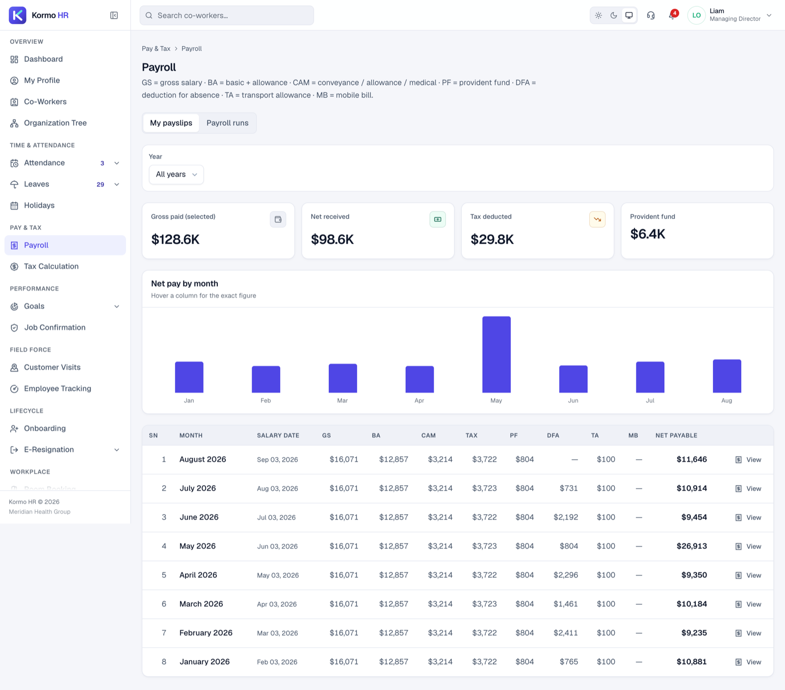
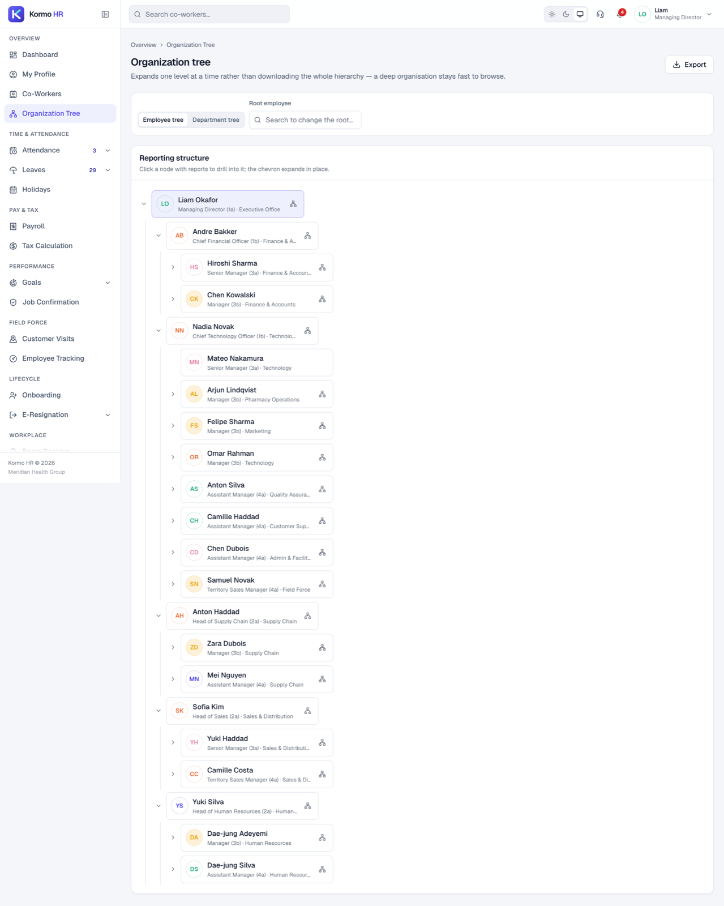
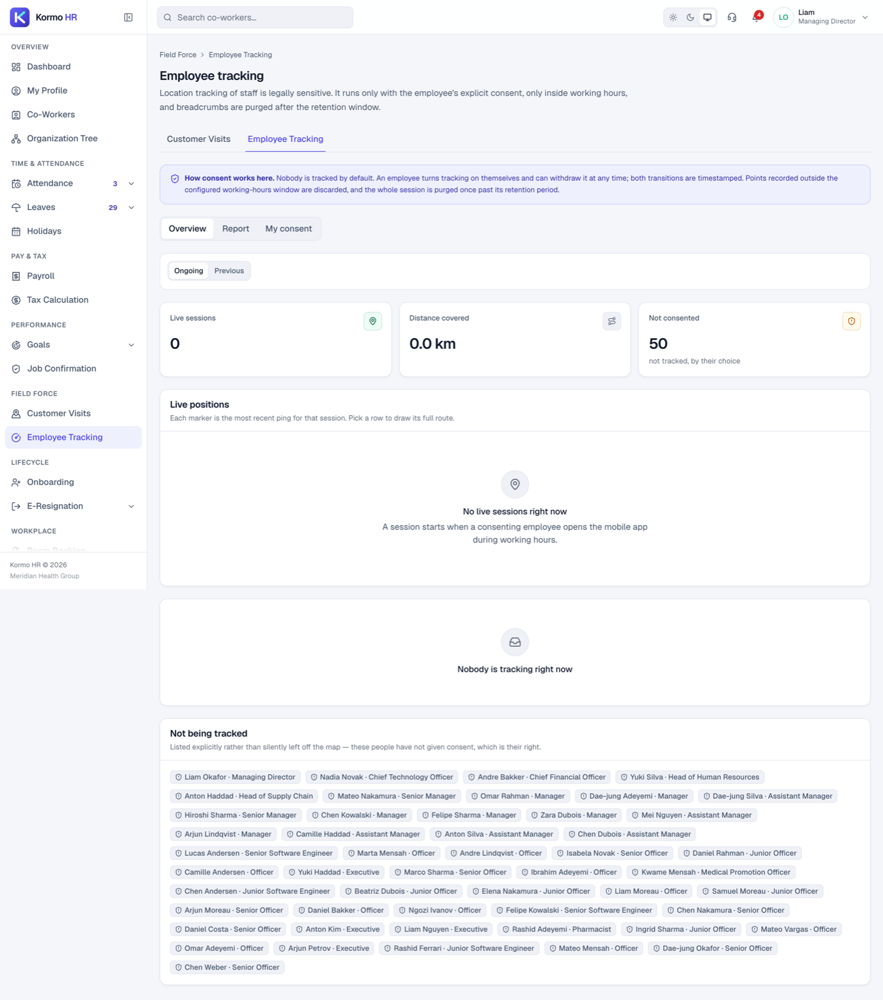
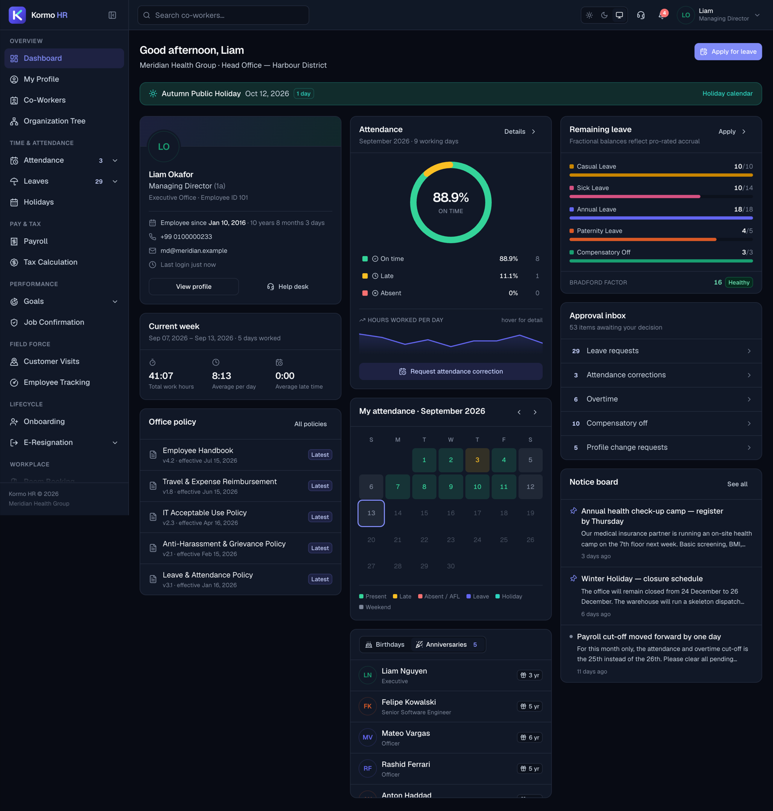

<div align="center">


**Open-source, multi-tenant HRMS for the full employee lifecycle — onboarding through clearance.**

Eighteen modules, one permission model, and pluggable country packs so payroll,
tax, holidays and the working week follow wherever you actually operate.

[**Live demo**](https://nazmul284.github.io/kormo-hr/) ·
[Quick start](#quick-start) ·
[Deployment](docs/DEPLOYMENT.md) ·
[Country packs](docs/LOCALIZATION.md) ·
[Architecture](docs/ARCHITECTURE.md)

[](https://github.com/nazmul284/kormo-hr/actions/workflows/ci.yml)
[](https://github.com/nazmul284/kormo-hr/actions/workflows/deploy-demo.yml)
[](LICENSE)
[](https://buymeacoffee.com/heynazmul)

</div>

---

## Try it without installing anything

**[nazmul284.github.io/kormo-hr](https://nazmul284.github.io/kormo-hr/)** — the real
front end, six roles to switch between, read-only.

It is not a mock. The bundle behind it is recorded from a real, seeded backend by
driving a browser through every route, so what the demo shows is by construction what
the product returned. Start as **Director** to see everything, or **Manager** for a
populated approval inbox.

<div align="center">



<sub>The Managing Director's dashboard — attendance, leave balances, approval inbox and notice board. Every figure is seeded demo data.</sub>

</div>

---

## What it is

A people-operations platform covering eighteen modules behind one permission model.

| | Module | Highlights |
|---|---|---|
| 👤 | **Profile** | 8 tabs, computed service length, self-service change requests routed to HR |
| 🧭 | **Directory & org tree** | Employee and department trees that expand one level at a time |
| ⏱ | **Attendance** | Monthly grid (IT/OT/LT/BT/TH/OTH), correction workflow, break-time detail |
| 🔁 | **Shift & roster** | Rotating patterns, conditional weekends, shift exchange with two-party consent |
| ⏰ | **Overtime & comp-off** | Requests, approvals, comp-off credited to a real leave balance |
| 🌴 | **Leave** | Live "leave days vs calendar days" preview, pro-rated accrual, carry-forward, Bradford factor |
| 📅 | **Holidays** | Per-country calendar, per-location overrides, optional religious observances |
| 💵 | **Payroll** | Runs with a state machine, payslips with the full earning/deduction ledger |
| 🧾 | **Tax** | Progressive engine — versioned, date-effective, per filing category, six countries |
| 🎯 | **Performance** | Goal cycles with weight validation, cascading goals, two-stage review |
| ✅ | **Job confirmation** | Probation scorecard; confirming flips employment status |
| 🗺 | **Field force** | Customer visits with GPS verification, consent-gated location tracking |
| 🚀 | **Onboarding** | Four-lane checklist (Employee · HR · IT · Manager) with blockers |
| 🚪 | **E-resignation** | Notice-period arithmetic, sequential approvals, department clearance, exit interview |
| 🚪 | **Room booking** | Day/week/month grid, conflict detection, recurring series |
| 🥗 | **Food** | Subsidised meal programme, rotating menu, cut-off-aware cancellation |
| 🛟 | **Help desk** | Category-routed tickets |
| 📊 | **Reports** | Async XLSX exports with presigned-style download |

---

## Quick start

**Prerequisites:** Node 22+, Docker.

```bash
git clone https://github.com/nazmul284/kormo-hr.git && cd kormo-hr
cp .env.example .env

npm run bootstrap     # install → containers → schema → seed demo data
npm run dev           # API on :4000, web on :3000
```

Open **<http://localhost:3000>** and sign in. API reference at
**<http://localhost:4000/api/docs>**.

Every demo account uses the password **`Kormo@123`**:

| Username | Role | What it shows |
|---|---|---|
| `md` | Managing Director | Everything, across both seeded companies |
| `hr.admin` | Head of HR | Company-wide views, change requests, resignation, clearance |
| `manager` | Line manager | A populated approval inbox: leave, corrections, overtime, comp-off |
| `payroll` | Payroll manager | Runs, register, company-wide tax position |
| `employee` | Employee | Pure self-service |
| `field` | Field force | Customer visits and GPS tracking with consent |
| `admin` | IT administrator | Onboarding IT lane, help desk, audit trail |

Full detail — configuration, determinism, troubleshooting — in
**[docs/SEEDING.md](docs/SEEDING.md)**.

---

## Country packs

Everything that differs between one country's HR setup and another's lives in one file.
Six ship; switching is one variable.

```bash
SEED_COUNTRY=IN npm run db:seed
```

| Code | Country | Currency | Weekend | Tax year | Income tax |
|---|---|---|---|---|---|
| `INTL` | International *(default)* | USD | Sat–Sun | January | Illustrative 5-band |
| `US` | United States | USD | Sat–Sun | January | Federal, 4 filing statuses |
| `GB` | United Kingdom | GBP | Sat–Sun | April | HMRC, personal allowance |
| `IN` | India | INR *(lakh/crore)* | Sat–Sun | April | New regime, 7 bands |
| `AE` | United Arab Emirates | AED | Sat–Sun | January | None — renders a nil statement |
| `BD` | Bangladesh | BDT *(lakh/crore)* | **Fri–Sat** | July | NBR, rebate + minimum tax |

A pack carries currency **and its grouping** — ₹12,34,567 and $1,234,567 are the same
number written for two different readers, and getting it wrong makes a salary read as
the wrong order of magnitude. It also carries the weekend, the timezone, the holiday
calendar, the tax slabs, and the formats for phone numbers and national IDs.

The design constraint is that **nothing outside `locale/packs/` branches on a country
code**. Adding a seventh country is two files and no changes anywhere else —
**[docs/LOCALIZATION.md](docs/LOCALIZATION.md)** walks through it, and it is the
contribution most wanted.

> **Every generated phone number and identifier is provably fake** — drawn from a range
> the regulator reserves for fiction (Ofcom's `07700 900xxx`, the NANP's `555-01xx`) or
> an all-zero body no operator issues. Companies, banks and universities in the demo
> data are invented. This repository is public and its seed data ends up in forks and
> screenshots; a "realistic" number is a stranger's phone ringing.

---

## A look around

<table>
<tr>
<td width="50%"><br><sub><b>Tax statement</b> — every intermediate step, so the figure on the payslip can be traced.</sub></td>
<td width="50%"><br><sub><b>Attendance</b> — monthly grid with in/out, late, break and overtime columns.</sub></td>
</tr>
<tr>
<td width="50%"><br><sub><b>Payroll</b> — runs with a state machine and the full earning/deduction ledger.</sub></td>
<td width="50%"><br><sub><b>Org tree</b> — expands one level at a time rather than dumping the hierarchy.</sub></td>
</tr>
<tr>
<td width="50%"><br><sub><b>Field force</b> — GPS-verified visits, tracking gated on explicit consent.</sub></td>
<td width="50%"><br><sub><b>Dark mode</b> — a validated second palette, not a dimmed first one.</sub></td>
</tr>
</table>

---

## Architecture

```
┌──────────────────────── same origin (:3000) ────────────────────────┐
│                                                                      │
│  Next.js 14 App Router          /api/*  ──rewrite──▶  NestJS :4000  │
│  · TanStack Query                                     · Prisma 6     │
│  · httpOnly cookie auth                               · PostgreSQL 16│
│  · Tailwind design tokens                             · Redis, MinIO │
│                                                                      │
└──────────────────────────────────────────────────────────────────────┘
                                    │
                     packages/shared — framework-agnostic
              tax engine · leave maths · permissions · country packs
```

**Why the API is proxied onto the app's own origin:** the system this replaces served
its API from a non-standard port, which made every request cross-origin and paid for a
CORS preflight before it. Same-origin removes that round trip and lets the auth cookies
be first-party `sameSite=lax`.

**`packages/shared` holds the logic that must not diverge.** The leave-day calculation
runs in the browser to preview "leave days vs calendar days" *and* on the server to
validate the submission — from one implementation, so the two can never disagree and
quietly cost someone a day.

See [`docs/ARCHITECTURE.md`](docs/ARCHITECTURE.md) for the full design and
[`docs/DECISIONS.md`](docs/DECISIONS.md) for what was deliberately done differently
from the system being replaced.

---

## The tax engine

Income tax is the highest-value module, so it is a pure, unit-tested function with
**nothing hardcoded** — slabs, the exemption, the investment allowance and the rebate
all live in the database, versioned per fiscal year and per filing category. A country
pack builds that configuration; the engine never learns which country it is running.

```
1  gross timeline    segment the FY on salary-effective dates
2  earning breakup   statutory heads, per the country pack, + bonuses
3  non-taxable       a flat standard deduction, or a capped proportional exemption
4  taxable           totalEarning − nonTaxable
5  slabs             progressive first-N ladder
6  rebate            pct of (pct of taxable), where the country grants one
7  liability         totalTax − rebate − advance tax, floored at any statutory minimum
8  paid to date      deduction-at-source ledger
9  monthly           remaining ÷ months left in the fiscal year
```

The two exemption shapes are the interesting part. Most of the world grants a flat
standard deduction; South Asia grants one that scales with earnings up to a ceiling.
The engine does one or the other, never both, and the UI labels the line to match —
"Standard deduction — flat $15,000" or "lesser of one third of earnings or ৳500,000".

The Bangladesh pack is pinned by tests to an independently verified NBR worked example,
so a refactor that moves any figure by a single taka fails the build:

```
earning 1,105,000 → non-taxable 368,334 → taxable 736,666
→ tax 35,499 → rebate 14,733 → liability 20,766
```

Rounding is *not* uniform (non-taxable ceils, tax and rebate floor, the monthly
instalment rounds half-up) because the statement lands on specific integers and a naive
`round()` drifts by one unit — which shows up as a payslip that will not reconcile.

```bash
npm run test -w @kormo/shared     # 57 assertions, including every edge case
```

---

## Verification

```bash
npm run test              # shared domain logic — tax, leave maths, attendance
npm run verify:api        # 120 checks across 7 roles — status codes, 403/401 boundaries, and response bodies
npm run verify:workflow   # 18 end-to-end write-path assertions with side-effect checks
npm run verify:ui         # drives real Chrome over 34 routes, screenshots each, fails on console errors
npm run typecheck         # API + web
npm run build             # production build of all three packages
```

`verify:workflow` asserts the things that actually matter: applying for leave *holds*
the balance so it cannot be double-spent, an overlap is refused with a specific message,
an employee cannot approve their own request, and a manager's approval moves the balance
**and** stamps the attendance rows. It cleans up after itself, so it is repeatable.

`verify:ui` waits for data rather than a fixed delay — a fixed sleep silently
screenshots loading skeletons, which is a check that passes while showing nothing.

CI runs all of it, plus a seed of **every country pack** against a real Postgres. That
last matrix is what catches a pack whose salary scale puts the entire workforce under
the tax threshold — something no typecheck can see.

---

## Security

| | |
|---|---|
| **Tokens** | httpOnly cookies, never browser storage — a stored token is exfiltratable by any XSS |
| **Refresh** | Rotating, with reuse detection: presenting an already-rotated token revokes the whole session family |
| **Authorisation** | Permissions are re-read from the database on **every request**. The client's cached permission set is a rendering hint only |
| **Row-level scope** | One `resolveScope`/`employeeScopeWhere` helper decides "who can see whom", so visibility cannot drift between modules |
| **Mass assignment** | Self-service profile edits write only through an explicit column whitelist |
| **Salary** | Gated on its own permission — seeing a report's profile deliberately does not imply seeing their pay |
| **Enumeration** | Login and password-reset run constant-time and never reveal whether an account exists |
| **Rate limits** | 10 sign-in attempts per minute per IP |
| **Id validation** | Route params are pattern-checked, so `/employees/undefined` is an honest 400 |
| **Audit** | Append-only trail on approvals, payroll locks and salary changes |
| **Location tracking** | Explicit consent with timestamps on both transitions, a working-hours window, and a retention limit |

Deploying it? The production checklist in [docs/DEPLOYMENT.md](docs/DEPLOYMENT.md) is
not optional. Vulnerability reports go through [SECURITY.md](SECURITY.md).

---

## Repository layout

```
apps/
  api/                    NestJS modular monolith
    prisma/
      schema.prisma       78 models
      seed/               deterministic demo-data generator
        packs/            per-country demo pools (names, banks, cities)
    src/
      common/             config, guards, scope helpers, tenant context
      modules/            18 feature modules
  web/                    Next.js 14 App Router — 35 pages
    src/
      app/(app)/          the authenticated shell and every route
      components/         ui primitives, charts, layout, dashboard widgets
      lib/                api client, session, locale, nav
    public/demo-data/     recorded fixtures behind the static demo
packages/
  shared/                 tax engine, leave maths, permissions, country packs
brand/                    logo (SVG + raster), favicon, wordmark
infra/                    docker-compose for Postgres, Redis, MinIO
scripts/                  verification and demo-capture harnesses
docs/                     architecture, decisions, deployment, seeding, localisation
```

---

## Contributing

Pull requests welcome — [CONTRIBUTING.md](CONTRIBUTING.md) covers the conventions and
what to run before opening one.

The most wanted contribution is **a country pack**. Six ship; the design makes a seventh
two files and no changes anywhere else. If you know how payroll works where you are,
that is the hard part and you already have it.

---

## Support this project

Kormo HR is free and MIT-licensed, and stays that way. If it saved you time — or if you
just want to keep the country packs coming:

<a href="https://buymeacoffee.com/heynazmul">
  
</a>

Starring the repository helps too, and costs nothing.

---

## Licence

[MIT](LICENSE). Do what you like with it, including commercially.

*Kormo* (কর্ম — *work, deeds*) started as a Bangladesh-first HRMS. It is now
country-agnostic; Bangladesh is one pack among six, and the name stayed.
